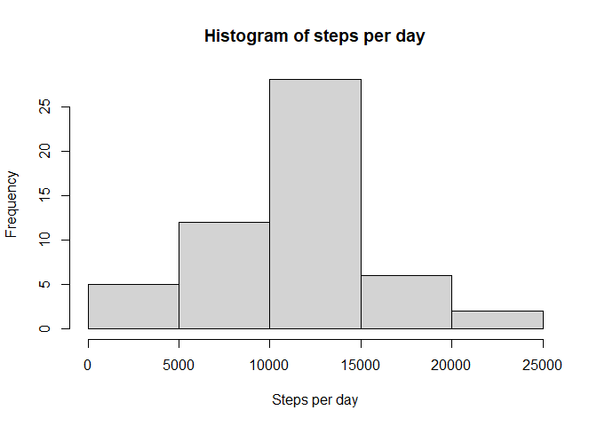
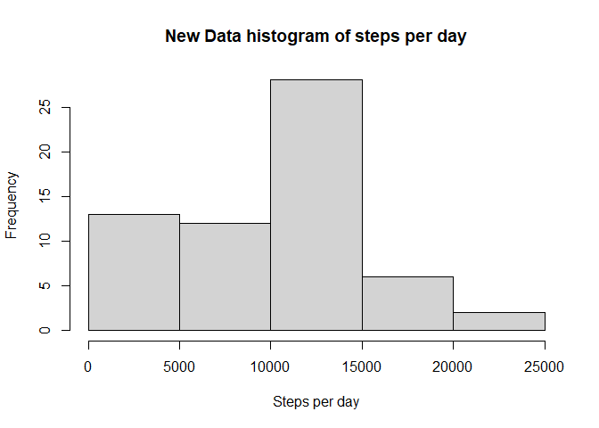
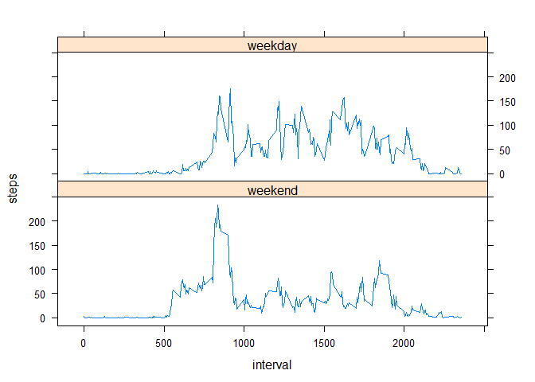

Before we start, let's call some libraries we will need:

```r
library(dplyr)
library(zoo)
library(lattice)
```
Now, we're ready.


## Loading and preprocessing the data
In this section, we will read the dataset we need, directly from the cloud.

```r
url <- "https://d396qusza40orc.cloudfront.net/repdata%2Fdata%2Factivity.zip"
temp <- tempfile()
download.file(url,temp)
data <- read.csv(unz(temp, "activity.csv"))
unlink(temp)

data$date <- as.Date(data$date, "%Y-%m-%d")
summary(data)
```

```
##      steps             date               interval     
##  Min.   :  0.00   Min.   :2012-10-01   Min.   :   0.0  
##  1st Qu.:  0.00   1st Qu.:2012-10-16   1st Qu.: 588.8  
##  Median :  0.00   Median :2012-10-31   Median :1177.5  
##  Mean   : 37.38   Mean   :2012-10-31   Mean   :1177.5  
##  3rd Qu.: 12.00   3rd Qu.:2012-11-15   3rd Qu.:1766.2  
##  Max.   :806.00   Max.   :2012-11-30   Max.   :2355.0  
##  NA's   :2304
```
Our data is ready and in the appropriate format.


## What is mean total number of steps taken per day?
First, we'll calculate the total number of steps taken per day.

```r
steps_per_day <- aggregate(steps~date,data=data,sum)
```

Then, we'll make a histogram of the total number of steps taken each day.

```r
hist(steps_per_day$steps, main="Histogram of steps per day",
      xlab="Steps per day")
```

<!-- -->
Finally, we'll calculate and report the mean and median of the total number of steps taken per day.

```r
mean(steps_per_day$steps)
```

```
## [1] 10766.19
```

```r
median(steps_per_day$steps)
```

```
## [1] 10765
```

## What is the average daily activity pattern?
Here, we have a time series plot of the 5-minute interval (x-axis) and the average number of steps taken, averaged across all days (y-axis).

```r
steps_per_int <- aggregate(steps~interval,data=data,mean)
with(steps_per_int,
plot(interval,steps,type="l"))
```

<!-- -->

Now, we'll ask the question: Which 5-minute interval, on average across all the days in the dataset, contains the maximum number of steps?

```r
with(steps_per_int,
interval[which(steps==max(steps))])
```

```
## [1] 835
```


## Imputing missing values
Calculate and report the total number of missing values in the dataset.

```r
sum(is.na(data$steps))
```

```
## [1] 2304
```
Devise a strategy for filling in all of the missing values in the dataset. I'll use the function **na.approx** of the zoo package. This function replace NAs by Interpolation, but only the internal NAs are replaced and leading or trailing NAs are omitted. leading or trailing NAs will be replaced by the closest valid value.

Create a new dataset that is equal to the original dataset but with the missing data filled in.

```r
# Replace NAs by interpolation
new_data <- data
new_data$steps <- zoo::na.approx(new_data$steps,na.rm=FALSE)

# Position of closest valid values
leading <- min(which(!is.na(new_data$steps)))
trailing <- max(which(!is.na(new_data$steps)))

# Replace by valid values
new_data$steps[1:(leading-1)] <- new_data$steps[leading]
new_data$steps[(trailing+1):nrow(new_data)] <- new_data$steps[trailing]

summary(new_data)
```

```
##      steps             date               interval     
##  Min.   :  0.00   Min.   :2012-10-01   Min.   :   0.0  
##  1st Qu.:  0.00   1st Qu.:2012-10-16   1st Qu.: 588.8  
##  Median :  0.00   Median :2012-10-31   Median :1177.5  
##  Mean   : 32.48   Mean   :2012-10-31   Mean   :1177.5  
##  3rd Qu.:  0.00   3rd Qu.:2012-11-15   3rd Qu.:1766.2  
##  Max.   :806.00   Max.   :2012-11-30   Max.   :2355.0
```
Make a histogram of the total number of steps taken each day and Calculate and report the mean and median total number of steps taken per day. We'll ask two questions. 

```r
new_steps_per_day <- aggregate(steps~date,data=new_data,sum)

hist(new_steps_per_day$steps, main="New Data histogram of steps per day",
      xlab="Steps per day")
```

<!-- -->

```r
# Original mean and new mean
(mean.org = mean(steps_per_day$steps)) 
```

```
## [1] 10766.19
```

```r
(mean.new = mean(new_steps_per_day$steps))
```

```
## [1] 9354.23
```

```r
# Original median and new median
(median.org = median(steps_per_day$steps))
```

```
## [1] 10765
```

```r
(median.new = median(new_steps_per_day$steps))
```

```
## [1] 10395
```

```r
# Relative error of mean
(error.mean = (mean.new-mean.org)/mean.org)
```

```
## [1] -0.1311475
```

```r
# Relative error of median
(error.median = (median.new-median.org)/median.org)
```

```
## [1] -0.03437065
```
1. Do these values differ from the estimates from the first part of the assignment?  
      *Yes, these new values are very different to the first one.*

2. What is the impact of imputing missing data on the estimates of the total daily number of steps?  
      *The mean decreased by 13.1% and the median by 3.4%*


## Are there differences in activity patterns between weekdays and weekends?
Create a new factor variable in the dataset with two levels – “weekday” and “weekend” indicating whether a given date is a weekday or weekend day.

```r
# Because of the language configuration
Sys.setlocale(category = "LC_ALL", locale = "english")
```

```
## [1] "LC_COLLATE=English_United States.1252;LC_CTYPE=English_United States.1252;LC_MONETARY=English_United States.1252;LC_NUMERIC=C;LC_TIME=English_United States.1252"
```

```r
# Create a new factor variable
data$type.day <- factor(ifelse(weekdays(data$date) %in% c("Saturday","Sunday"),"weekend","weekday"),labels=c("weekend","weekday"))

summary(data)
```

```
##      steps             date               interval         type.day    
##  Min.   :  0.00   Min.   :2012-10-01   Min.   :   0.0   weekend:12960  
##  1st Qu.:  0.00   1st Qu.:2012-10-16   1st Qu.: 588.8   weekday: 4608  
##  Median :  0.00   Median :2012-10-31   Median :1177.5                  
##  Mean   : 37.38   Mean   :2012-10-31   Mean   :1177.5                  
##  3rd Qu.: 12.00   3rd Qu.:2012-11-15   3rd Qu.:1766.2                  
##  Max.   :806.00   Max.   :2012-11-30   Max.   :2355.0                  
##  NA's   :2304
```
Make a panel plot containing a time series plot of the 5-minute interval (x-axis) and the average number of steps taken, averaged across all weekday days or weekend days (y-axis).

```r
steps_per_int2 <- aggregate(steps~interval+type.day,data=data,mean)
       
xyplot(steps~interval|type.day,data=steps_per_int2,type="l",layout=c(1,2))
```

<!-- -->

Thanks!


